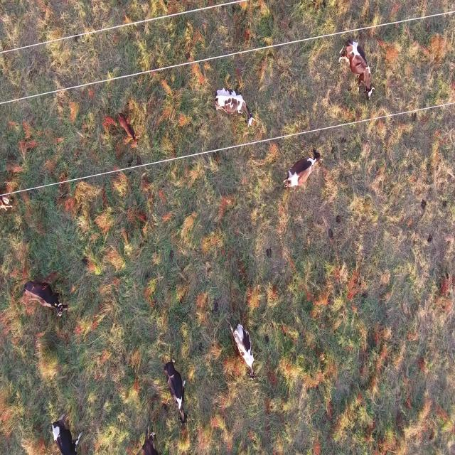
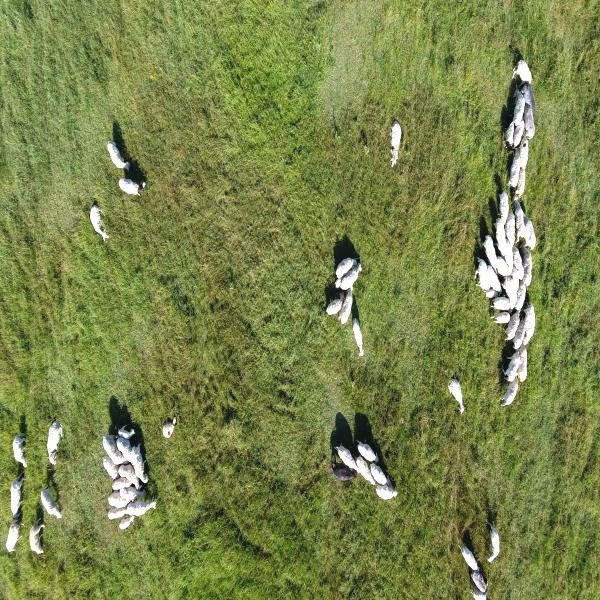
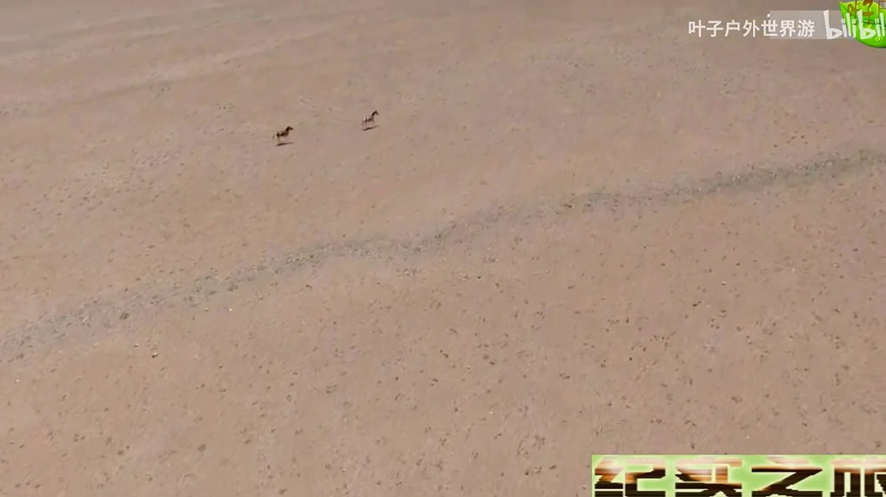
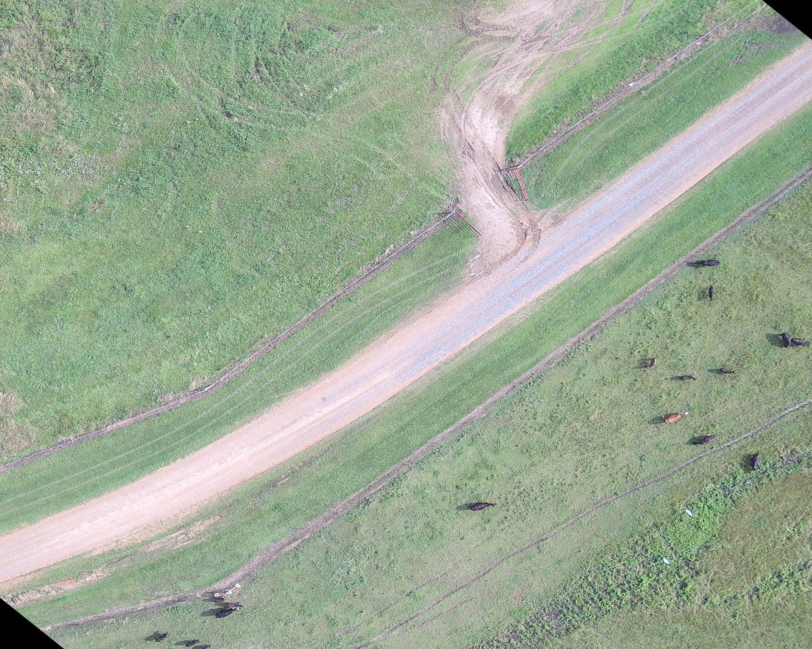
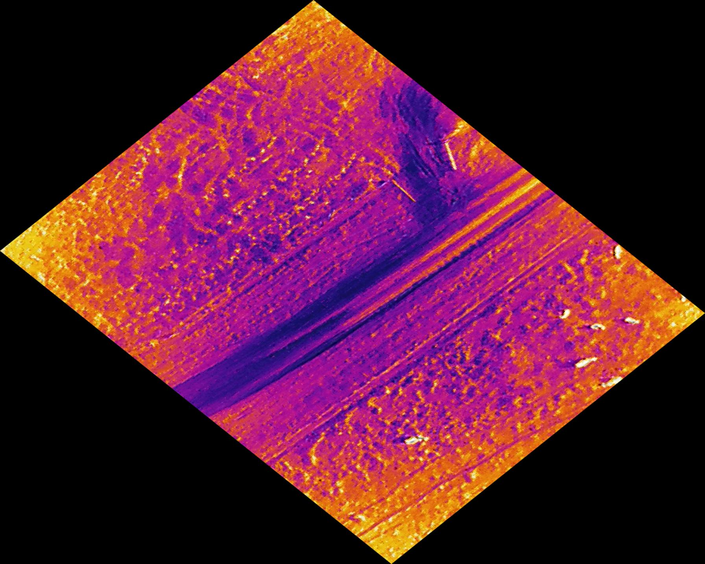
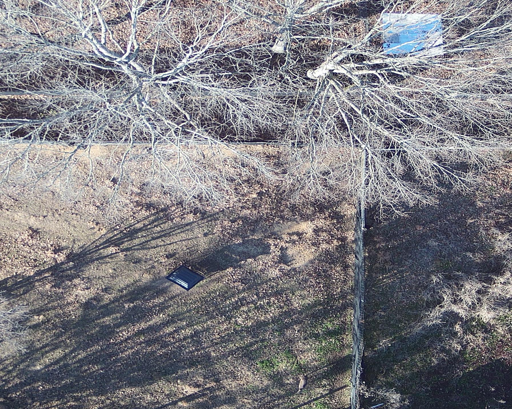
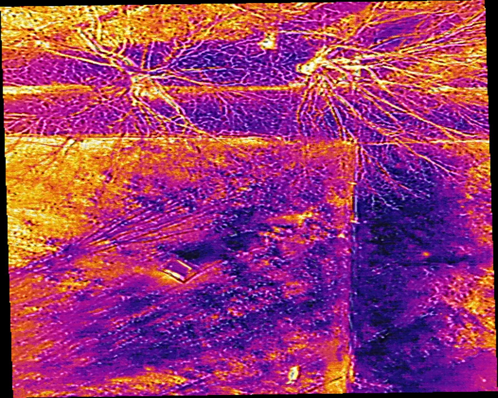
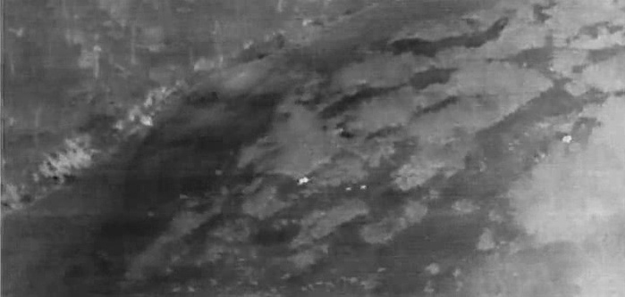
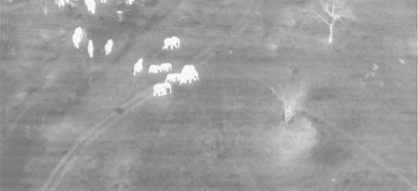
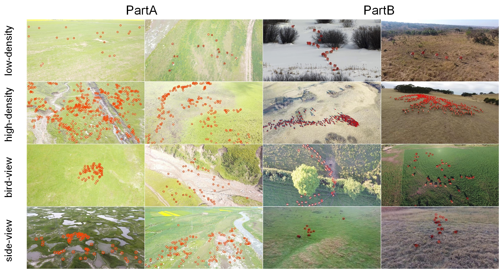

# Aerial Animal Datasets

This repository contains a collection of wildlife annotated images from aerial view (either drones or satellites). 

## Datasets

### U. Sherbrooke Red Deer Dataset

https://doi.org/10.5683/SP3/TELIYD

- **Species**: Red Deer
- **Method**: Drone
- **View**: Birdview
- **Location**: A farm near Lachute, Quebec, Canada
- **Date**: September 2018 (Summer), March 2019 (Winter)
- **Images**: It contains 4,071 images in total
    - 1,531 train images in summer
        - 328 images with red deer (3052 total deer)
    - 512 validation images in summer
        - 67 images with red deer (958 total deer)
    - 1,784 train images in winter
        - 437 images with red deer (4652 total deer)
    - 244 validation images in winter
        - 86 images with red deer (675 total deer)
- **Channels**: RGB
- **Annotation format**: COCO JSON

  
   

**Paper**: Moreni, M., Theau, J., & Foucher, S. (2023). Do you get what you see? Insights of using mAP to select architectures of pretrained neural networks for automated aerial animal detection. Plos one, 18(4), e0284449. https://doi.org/10.1371/journal.pone.0284449

### WAID (Wildlife Aerial Images from Drone)

https://github.com/xiaohuicui/WAID

- **Species**: Zebra, Cattle, Camelus, Kiang, Sheep, Seal
- **Method**: Drone & Webscraping
- **View**: Birdview & Oblique
- **Location**: Various
- **Date**: Various
- **Images**: It contains 14,375 images in total
    - 11,118 train images
        - 3,602 images with sheep
        - 3,301 images with cattle
        - 2,709 images with seal
        - 512 images with camelus
        - 443 images with zebra
        - 551 images with kiang
    - 2,054 validation images
        - 349 images with sheep
        - 943 images with cattle
        - 330 images with seal
        - 149 images with camelus
        - 126 images with zebra
        - 157 images with kiang
    - 1,203 test images
        - 173 images with sheep
        - 471 images with cattle
        - 329 images with seal
        - 82 images with camelus
        - 65 images with zebra
        - 74 images with kiang
- **Channels**: RGB
- **Annotation format**: YOLO

  
  
  

**Paper**: Mou, C., Liu, T., Zhu, C., & Cui, X. (2023). WAID: A Large-Scale Dataset for Wildlife Detection with Drones. Applied Sciences, 13(18), 10397. https://doi.org/10.3390/app131810397

### AWIR (Aerial Wildlife Image Repository)

https://scholarsjunction.msstate.edu/gri-publications/2/

The paper report more images than there are publicly available. The following specifiations are based on the available images, which are specified in this paper: https://www.nature.com/articles/s41598-023-37295-7.pdf

- **Species**: Cow, Horse, White-tailed deer
- **Method**: Drone
- **View**: Birdview
- **Location**: Mississippi, USA
- **Date**: 2021 & 2022
- **Images**: It contains 164 images in total
    - 117 train images
        - 51 images with cow (218 total cows)
        - 38 images with deer (61 total deer)
        - 28 images with horse (88 total horses)
    - 14 validation images
        - 4 images with cow (16 total cows)
        - 5 images with deer (5 total deer)
        - 5 images with horse (18 total horses)
    - 33 test images
        - 13 images with cow (31 total cows)
        - 10 images with deer (11 total deer)
        - 10 images with horse (30 total horses)
- **Channels**: RGB & Thermal
- **Annotation format**: YOLO

  
  
  
  

**Paper**: Sathishkumar Samiappan, B. Santhana Krishnan, Damion Dehart, Landon R Jones, Jared A Elmore, Kristine O Evans, Raymond B Iglay, Aerial Wildlife Image Repository for animal monitoring with drones in the age of artificial intelligence, Database, Volume 2024, 2024, baae070, https://doi.org/10.1093/database/baae070

### BIRDSAI (Benchmarking IR Dataset for Surveillance with Aerial Intelligence)

https://sites.google.com/view/elizabethbondi/dataset

- **Species**: Human, elephant, lion, giraffe, dog, crocodile, hippo, zebra, rhino, unknown
- **Method**: Drone
- **View**: Oblique
- **Location**: South Africa, Malawi and Zimbabwe
- **Date**: 2020
- **Images**: It contains 48 real-world videos (1300 frames on average) and 124 synthetic videos (800 frames on average)
- **Channels**: Thermal
- **Annotation format**: MOT

    
    

**Paper**: Bondi, E., Jain, R., Aggrawal, P., Anand, S., Hannaford, R., Kapoor, A., ... & Tambe, M. (2020). BIRDSAI: A dataset for detection and tracking in aerial thermal infrared videos. In Proceedings of the IEEE/CVF Winter conference on applications of computer vision (pp. 1747-1756). http://openaccess.thecvf.com/content_WACV_2020/papers/Bondi_BIRDSAI_A_Dataset_for_Detection_and_Tracking_in_Aerial_Thermal_WACV_2020_paper.pdf

### WildlifeMapper Dataset

https://github.com/UCSB-VRL/WildlifeMapper

- **Species**: cattle, white-bearded wildebeest, topi, shoats, kongoni, waterbuck, impala, Grant’s gazelle, Thomson’s gazelle, Cape buffalo, zebra, ostrich, Masai giraffe, warthog, eland, donkey, hyena, hippopotomus, lion, and elephant
- **Method**: Drone
- **View**: Birdview
- **Location**: Democratic Republic of Congo (DRC), Botswana, Namibia, and South Africa
- **Date**: 2024
- **Images**: It contains 11,151 images in total
- **Channels**: RGB
- **Annotation format**: XML, KML or GeoJSON

    
    

**Paper**: Kumar, S., Zhang, B., Gudavalli, C., Levenson, C., Hughey, L., Stabach, J. A., ... & Manjunath, B. S. (2024). WildlifeMapper: Aerial Image Analysis for Multi-Species Detection and Identification. In Proceedings of the IEEE/CVF Conference on Computer Vision and Pattern Recognition (pp. 12594-12604). http://openaccess.thecvf.com/content/CVPR2024/papers/Kumar_WildlifeMapper_Aerial_Image_Analysis_for_Multi-Species_Detection_and_Identification_CVPR_2024_paper.pdf

### AnimalDrone

https://github.com/VisDrone/AnimalDrone

This dataset is only available through BaiDuYun, which makes it difficult to access. The following information is based on the paper: https://isrc.iscas.ac.cn/zhanglibo/pdfs/2021/IEEE_Transactions_on_Image_Processing_2021_02.pdf

- **Species**: Sheep, cow, horse, yak, wolf, antelope, dog, boar, zebra, giraffe
- **Method**: Drone
- **View**: Birdview and Oblique
- **Location**: China
- **Date**: 2021
- **Images**: It contains 53,644 images in total with 4,049,168 annotations
- **Channels**: RGB
- **Annotation format**: Dots (unknown format)

    

**Paper**: Zhu, P., Peng, T., Du, D., Yu, H., Zhang, L., & Hu, Q. (2021). Graph regularized flow attention network for video animal counting from drones. IEEE Transactions on Image Processing, 30, 5339-5351. https://isrc.iscas.ac.cn/zhanglibo/pdfs/2021/IEEE_Transactions_on_Image_Processing_2021_02.pdf
