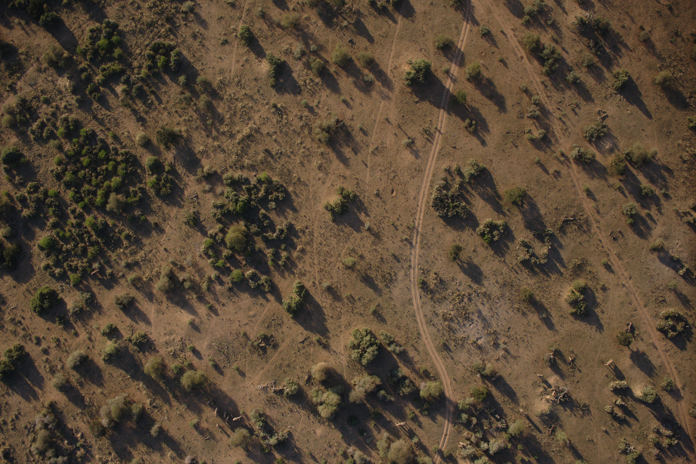
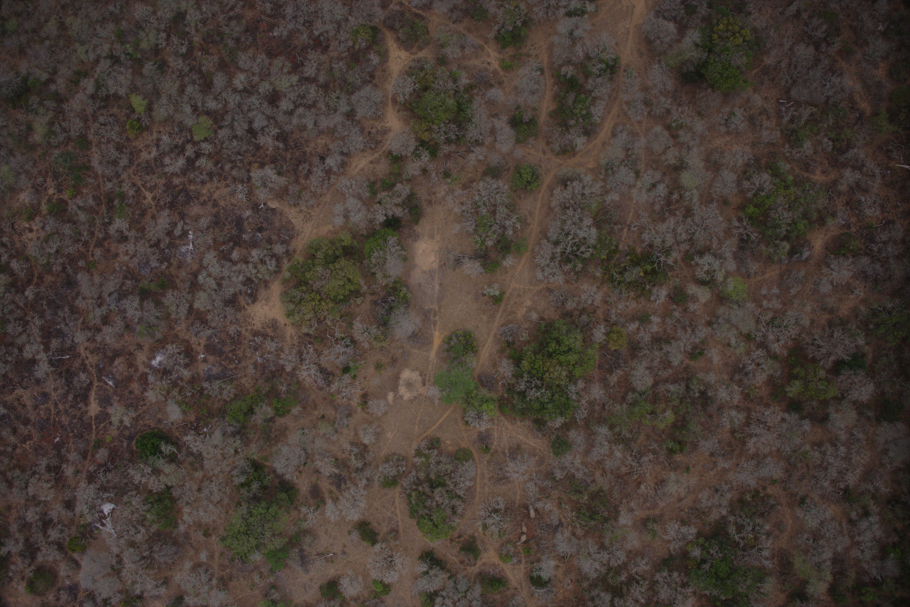
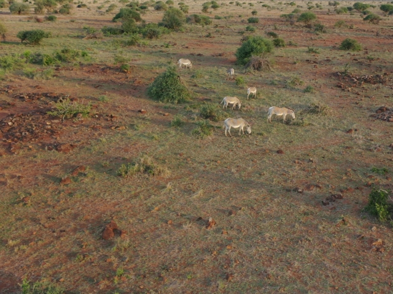
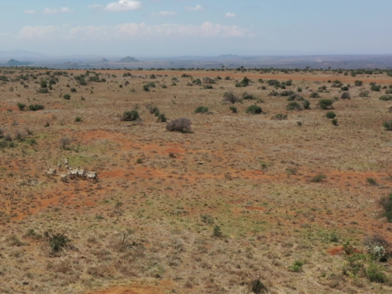
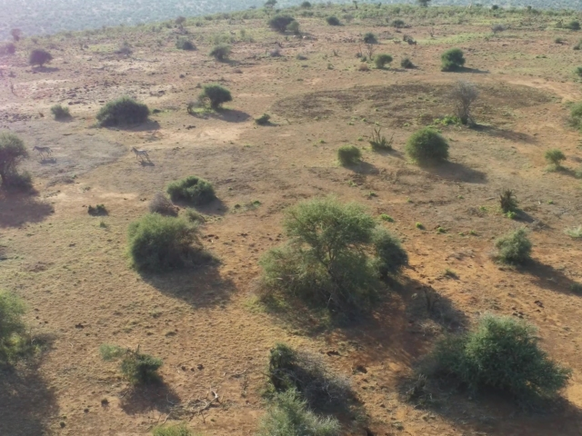
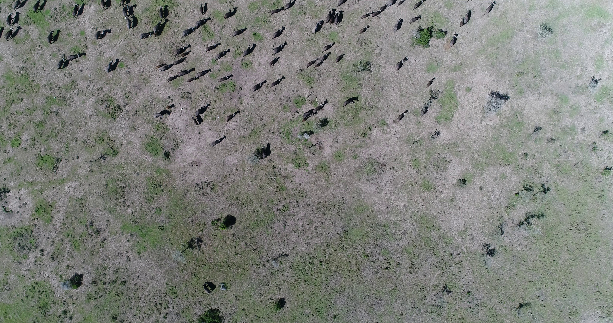

# Aerial Wildlife Datasets for Object Detection

This repository contains a collection of wildlife annotated images from aerial view (either drones or satellites). Please create an issue if you want to add a dataset to this list.

## Table of Contents

- [Grassland Animals Datasets](#grassland-animals-datasets)
  - [U. Sherbrooke Red Deer Dataset](#u-sherbrooke-red-deer-dataset)
  - [WAID (Wildlife Aerial Images from Drone)](#waid-wildlife-aerial-images-from-drone)
  - [Liege University of African Mammals Dataset](#liege-university-of-african-mammals-dataset)
  - [AWIR (Aerial Wildlife Image Repository)](#awir-aerial-wildlife-image-repository)
  - [WildlifeMapper Dataset](#wildlifemapper-dataset)
  - [Wageningen Dataset](#wageningen-dataset)
  - [The Aerial Elephant Dataset (AED)](#the-aerial-elephant-dataset-aed)
  - [Kenyan Zebras Dataset](#kenyan-zebras-dataset)
  - [African ungulate and gelada dataset](#african-ungulate-and-gelada-dataset)
  - [BIRDSAI (Benchmarking IR Dataset for Surveillance with Aerial Intelligence)](#birdsai-benchmarking-ir-dataset-for-surveillance-with-aerial-intelligence)
  - [AnimalDrone](#animaldrone)
- [Other related datasets](#other-related-datasets)
  - [Birds](#birds)
  - [Other animals](#other-animals)

## Grassland Animals Datasets

### U. Sherbrooke Red Deer Dataset

https://doi.org/10.5683/SP3/TELIYD

- **Species**: Red Deer
- **Method**: UAV
- **View**: Birdview
- **Location**: A farm near Lachute, Quebec, Canada
- **Date**: September 2018 (Summer), March 2019 (Winter)
- **Images**: It contains 4,071 images in total
    - 1,531 train images in summer
        - 328 images with red deer (3052 total deer)
    - 512 validation images in summer
        - 67 images with red deer (958 total deer)
    - 1,784 train images in winter
        - 437 images with red deer (4652 total deer)
    - 244 validation images in winter
        - 86 images with red deer (675 total deer)
- **Channels**: RGB
- **Annotation format**: COCO JSON

  
   

**Paper**: Moreni, M., Theau, J., & Foucher, S. (2023). Do you get what you see? Insights of using mAP to select architectures of pretrained neural networks for automated aerial animal detection. Plos one, 18(4), e0284449. https://doi.org/10.1371/journal.pone.0284449

### WAID (Wildlife Aerial Images from Drone)

https://github.com/xiaohuicui/WAID

- **Species**: Zebra, Cattle, Camelus, Kiang, Sheep, Seal
- **Method**: UAV & Webscraping
- **View**: Birdview & Oblique
- **Location**: Various
- **Date**: Various
- **Images**: It contains 14,375 images in total
    - 11,118 train images
        - 3,602 images with sheep
        - 3,301 images with cattle
        - 2,709 images with seal
        - 512 images with camelus
        - 443 images with zebra
        - 551 images with kiang
    - 2,054 validation images
        - 349 images with sheep
        - 943 images with cattle
        - 330 images with seal
        - 149 images with camelus
        - 126 images with zebra
        - 157 images with kiang
    - 1,203 test images
        - 173 images with sheep
        - 471 images with cattle
        - 329 images with seal
        - 82 images with camelus
        - 65 images with zebra
        - 74 images with kiang
- **Channels**: RGB
- **Annotation format**: YOLO

  
  
  

**Paper**: Mou, C., Liu, T., Zhu, C., & Cui, X. (2023). WAID: A Large-Scale Dataset for Wildlife Detection with Drones. Applied Sciences, 13(18), 10397. https://doi.org/10.3390/app131810397

### Liege University of African Mammals Dataset

https://dataverse.uliege.be/file.xhtml?fileId=11098&version=1.0

- **Species**: Buffalo, elephant, Kob, Topi, Warthog, Waterbuck
- **Method**: UAV
- **View**: Birdview
- **Location**: DRC, Botswana, Namibia, South Africa
- **Date**: 2014-2018
- **Images**: It contains 10,239 images in total
    - 6,962 train images
        - 1,058 buffalos
        - 2,012 elephants
        - 1,732 kobs
        - 1,678 topis
        - 316 warthogs
        - 166 waterbucks
    - 978 validation images
        - 102 buffalos
        - 264 elephants
        - 161 kobs
        - 369 topis
        - 43 warthogs
        - 39 waterbucks
    - 2,299 test images
        - 349 buffalos
        - 688 elephants
        - 477 kobs
        - 675 topis
        - 74 warthogs
        - 36 waterbucks
- **Channels**: RGB
- **Annotation format**: CSV

    
    
    

**Paper**: Delplanque, A., Foucher, S., Lejeune, P., Linchant, J., & Théau, J. (2022). Multispecies detection and identification of African mammals in aerial imagery using convolutional neural networks. Remote Sensing in Ecology and Conservation, 8(2), 166-179. https://zslpublications.onlinelibrary.wiley.com/doi/pdfdirect/10.1002/rse2.234

### AWIR (Aerial Wildlife Image Repository)

https://scholarsjunction.msstate.edu/gri-publications/2/

The paper report more images than there are publicly available. The following specifiations are based on the available images, which are specified in this paper: https://www.nature.com/articles/s41598-023-37295-7.pdf

- **Species**: Cow, Horse, White-tailed deer
- **Method**: UAV
- **View**: Birdview
- **Location**: Mississippi, USA
- **Date**: 2021 & 2022
- **Images**: It contains 164 images in total
    - 117 train images
        - 51 images with cow (218 total cows)
        - 38 images with deer (61 total deer)
        - 28 images with horse (88 total horses)
    - 14 validation images
        - 4 images with cow (16 total cows)
        - 5 images with deer (5 total deer)
        - 5 images with horse (18 total horses)
    - 33 test images
        - 13 images with cow (31 total cows)
        - 10 images with deer (11 total deer)
        - 10 images with horse (30 total horses)
- **Channels**: RGB & Thermal
- **Annotation format**: YOLO

  
  
  
  

**Paper**: Sathishkumar Samiappan, B. Santhana Krishnan, Damion Dehart, Landon R Jones, Jared A Elmore, Kristine O Evans, Raymond B Iglay, Aerial Wildlife Image Repository for animal monitoring with drones in the age of artificial intelligence, Database, Volume 2024, 2024, baae070, https://doi.org/10.1093/database/baae070

### WildlifeMapper Dataset

https://github.com/UCSB-VRL/WildlifeMapper

- **Species**: cattle, white-bearded wildebeest, topi, shoats, kongoni, waterbuck, impala, Grant’s gazelle, Thomson’s gazelle, Cape buffalo, zebra, ostrich, Masai giraffe, warthog, eland, donkey, hyena, hippopotomus, lion, and elephant
- **Method**: UAV
- **View**: Birdview
- **Location**: Democratic Republic of Congo (DRC), Botswana, Namibia, and South Africa
- **Date**: 2024
- **Images**: It contains 11,151 images in total
- **Channels**: RGB
- **Annotation format**: XML, KML or GeoJSON

    
    

**Paper**: Kumar, S., Zhang, B., Gudavalli, C., Levenson, C., Hughey, L., Stabach, J. A., ... & Manjunath, B. S. (2024). WildlifeMapper: Aerial Image Analysis for Multi-Species Detection and Identification. In Proceedings of the IEEE/CVF Conference on Computer Vision and Pattern Recognition (pp. 12594-12604). http://openaccess.thecvf.com/content/CVPR2024/papers/Kumar_WildlifeMapper_Aerial_Image_Analysis_for_Multi-Species_Detection_and_Identification_CVPR_2024_paper.pdf

### Wageningen Dataset

https://data.4tu.nl/articles/dataset/Improving_the_precision_and_accuracy_of_animal_population_estimates_with_aerial_image_object_detection/12713903/1

- **Species**: Elephant, giraffe, zebra
- **Method**: UAV
- **View**: Oblique
- **Location**: Kenya
- **Date**: 2019
- **Images**: It contains 561 images in total
    - 393 train images
        - 2,640 elephants
        - 2,160 giraffes
        - 4,182 zebras
    - 56 validation images
        - 140 elephants
        - 93 giraffes
        - 219 zebras
    - 112 test images
        - 288 elephants
        - 261 giraffes
        - 301 zebras
- **Channels**: RGB
- **Annotation format**: CSV

    
    
    

**Paper**: Eikelboom, J. A., Wind, J., Van de Ven, E., Kenana, L. M., Schroder, B., De Knegt, H. J., ... & Prins, H. H. (2019). Improving the precision and accuracy of animal population estimates with aerial image object detection. Methods in Ecology and Evolution, 10(11), 1875-1887. https://besjournals.onlinelibrary.wiley.com/doi/pdfdirect/10.1111/2041-210X.13277

### The Aerial Elephant Dataset (AED)

https://zenodo.org/records/3234780

- **Species**: Elephant
- **Method**: UAV
- **View**: Birdview
- **Location**: South Africa, Botswana, Namibia
- **Date**: 2014 to 2018
- **Images**: It contains 2,101 images in total
    - 1,649 train images
        - 12,455 elephants
    - 452 test images
        - 3,056 elephants
- **Channels**: RGB
- **Annotation format**: CSV (points)

    
    

**Paper**: Naude, J., & Joubert, D. (2019). The aerial elephant dataset: A new public benchmark for aerial object detection. In Proceedings of the IEEE/CVF Conference on Computer Vision and Pattern Recognition Workshops (pp. 48-55). https://openaccess.thecvf.com/content_CVPRW_2019/papers/DOAI/Naude_The_Aerial_Elephant_Dataset_A_New_Public_Benchmark_for_Aerial_CVPRW_2019_paper.pdf

### Kenyan Zebras Dataset

https://keeper.mpdl.mpg.de/d/a9822e000aff4b5391e1/

- **Species**: Zebra
- **Method**: UAV
- **View**: Oblique
- **Location**: Kenya
- **Date**: 2022
- **Images**: It contains 30,627 images in total
    - 162,799 zebras (258 unique zebras)
- **Channels**: RGB
- **Annotation format**: COCO JSON

    
    
    

**Paper**: Price, E., Khandelwal, P. C., Rubenstein, D. I., & Ahmad, A. (2023). A framework for fast, large-scale, semi-automatic inference of animal behavior from monocular videos. bioRxiv, 2023-07. https://www.biorxiv.org/content/biorxiv/early/2023/08/02/2023.07.31.551177.full.pdf

### African ungulate and gelada dataset

https://edmond.mpdl.mpg.de/dataset.xhtml?persistentId=doi:10.17617/3.EMRZGH

- **Species**: zebra, gazelle, waterbuck, buffalo, other, gelada, human
- **Method**: UAV
- **View**: Birdview
- **Location**: Ethiopia and Kenya
- **Date**: 2017-2020
- **Images**: It contains 1,982 images in total
- **Channels**: RGB
- **Annotation format**: COCO JSON

    
    

**Paper**: Koger, B., Deshpande, A., Kerby, J. T., Graving, J. M., Costelloe, B. R., & Couzin, I. D. (2023). Quantifying the movement, behaviour and environmental context of group‐living animals using drones and computer vision. Journal of Animal Ecology, 92(7), 1357-1371. https://besjournals.onlinelibrary.wiley.com/doi/pdfdirect/10.1111/1365-2656.13904

### BIRDSAI (Benchmarking IR Dataset for Surveillance with Aerial Intelligence)

https://sites.google.com/view/elizabethbondi/dataset

- **Species**: Human, elephant, lion, giraffe, dog, crocodile, hippo, zebra, rhino, unknown
- **Method**: UAV
- **View**: Oblique
- **Location**: South Africa, Malawi and Zimbabwe
- **Date**: 2020
- **Images**: It contains 48 real-world videos (1300 frames on average) and 124 synthetic videos (800 frames on average)
- **Channels**: Thermal
- **Annotation format**: MOT

    
    

**Paper**: Bondi, E., Jain, R., Aggrawal, P., Anand, S., Hannaford, R., Kapoor, A., ... & Tambe, M. (2020). BIRDSAI: A dataset for detection and tracking in aerial thermal infrared videos. In Proceedings of the IEEE/CVF Winter conference on applications of computer vision (pp. 1747-1756). http://openaccess.thecvf.com/content_WACV_2020/papers/Bondi_BIRDSAI_A_Dataset_for_Detection_and_Tracking_in_Aerial_Thermal_WACV_2020_paper.pdf

### AnimalDrone

https://github.com/VisDrone/AnimalDrone

This dataset is only available through BaiDuYun, which makes it difficult to access. The following information is based on the paper: https://isrc.iscas.ac.cn/zhanglibo/pdfs/2021/IEEE_Transactions_on_Image_Processing_2021_02.pdf

- **Species**: Sheep, cow, horse, yak, wolf, antelope, dog, boar, zebra, giraffe
- **Method**: UAV
- **View**: Birdview and Oblique
- **Location**: China
- **Date**: 2021
- **Images**: It contains 53,644 images in total with 4,049,168 annotations
- **Channels**: RGB
- **Annotation format**: Dots (unknown format)

    

**Paper**: Zhu, P., Peng, T., Du, D., Yu, H., Zhang, L., & Hu, Q. (2021). Graph regularized flow attention network for video animal counting from drones. IEEE Transactions on Image Processing, 30, 5339-5351. https://isrc.iscas.ac.cn/zhanglibo/pdfs/2021/IEEE_Transactions_on_Image_Processing_2021_02.pdf

## Other related datasets

### Birds

- [Waterfowl Thermal Dataset](https://data.mendeley.com/datasets/46k66mz9sz/4)
- [EpicDuck Challenge Dataset](https://datadryad.org/dataset/doi:10.5061/dryad.rd736)
- [British Antarctic Survey (BAS) Penguin Dataset](https://zenodo.org/records/7702635#.ZChnoHZBxD8)
- [Florida Wading Birds Dataset](https://zenodo.org/records/5033174)
- [Alaskan Waterfowl Dataset](https://alaska.usgs.gov/products/data.php?dataid=484)
- [Malvinas Islands Penguin and Albatross Dataset](https://research.repository.duke.edu/concern/datasets/kp78gh20s)
- [Aerial Seabirds West Africa](https://lila.science/datasets/aerial-seabirds-west-africa/)
- [Texas Waterbirds Dataset](https://drive.google.com/file/d/1hoP1ev8Npj5m0MZWZU7LpjU9c8JYYoFe/view?usp=share_link)
- [New Mexico Waterfowl Dataset](https://lila.science/datasets/uas-imagery-of-migratory-waterfowl-at-new-mexico-wildlife-refuges)

### Other animals

- [Costa Rica Sea Turtles Dataset](https://zenodo.org/records/5004596#.ZChnr3ZBxD8)
- [NOAA Sea Lions Dataset](https://www.kaggle.com/c/noaa-fisheries-steller-sea-lion-population-count)
- [NOAA Right Whales Dataset](https://www.kaggle.com/c/noaa-right-whale-recognition)
- [NOAA Arctic Seals Dataset](https://lila.science/datasets/noaa-arctic-seals-2019/)
- [Indian Crocodiles Dataset](https://datadryad.org/stash/landing/show?id=doi%3A10.5061%2Fdryad.s4mw6m98n)
- [Whales from Space](https://doi.org/10.5285/C1AFE32C-493C-4DC7-AF9F-649593B97B2C)
